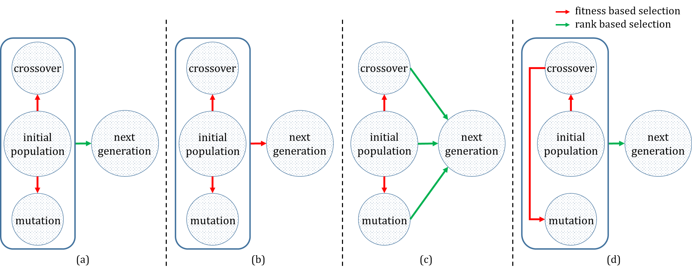

<!--  -->
<!--  -->

# GenomiX

A Python implementation of real-valued genetic algorithms for hyperparameter optimization in machine learning, particularly focused on applications in chemistry and materials science.


## Description

GenomiX is a robust framework for autonomous machine learning model selection and hyperparameter optimization via evolutionary algorithms. Developed as part of research at the University at Buffalo, this package implements four variations of genetic algorithm strategies that outperform commonly used optimization algorithms in both computational efficiency and prediction accuracy.

The framework is particularly valuable for chemical and materials science applications, where data characteristics differ significantly from typical data science domains. GenomiX allows researchers to automatically identify optimal machine learning models and hyperparameters without requiring extensive manual tuning or domain expertise.

Key features include:
- Four distinct selection schemes for genetic algorithm optimization
- Support for single and multi-objective optimization
- Flexible hyperparameter space specification (continuous, integer, categorical variables)
- Customizable crossover and mutation operations
- Batch mode for expensive objective functions
- Statistical analysis of hyperparameter performance

This implementation is based on research published in "Towards Autonomous Machine Learning in Chemistry via Evolutionary Algorithms".

## Installation

### Prerequisites

- Python 3.6 or higher
- NumPy
- Pandas
- Matplotlib
- Seaborn

### Installation Steps

1. Clone the repository:
```bash
git clone https://github.com/gvishwak/genomix.git
cd genomix
```

2. Install the package and its dependencies:
```bash
pip install .
```

   Alternatively, install the required dependencies manually:
```bash
pip install numpy pandas matplotlib seaborn
```

3. Verify installation:
```bash
python -c "import genomix; print(genomix.__version__)"
```

### Development Setup

1. Install development dependencies:
```bash
pip install -e ".[dev]"
```

2. Run tests:
```bash
pytest tests/
```

## Usage

### Basic Example

```python
import numpy as np
from genomix.genetic_algorithm import GeneticAlgorithm

# Define your objective function to minimize
def objective_function(**kwargs):
    individual = kwargs['ga_individual']
    x, y = individual
    # Rosenbrock function
    return [(1 - x)**2 + 100 * (y - x**2)**2]

# Define the hyperparameter space
space = {
    'x': {'uniform': [-2.0, 2.0], 'mutation': [0, 0.5]},
    'y': {'uniform': [-2.0, 2.0], 'mutation': [0, 0.5]}
}

# Initialize genetic algorithm
ga = GeneticAlgorithm(
    objective_function=objective_function,
    objective_function_params={},
    space=space,
    fitness=("Min",),
    population_size=30,
    crossover_size=20,
    mutation_size=10,
    crossover_type="Blend",
    algorithm=1
)

# Run the optimization
best_ind_df, best_ind_dict = ga.search(
    batch_mode=False,
    n_generations=20,
    early_stopping=10
)

print("Best solution found:", best_ind_dict)
print("Best fitness value:", best_ind_df['Fitness_values'].iloc[-1])
```

### Using Batch Mode for Expensive Evaluations

```python
# Initialize the GA as before
ga = GeneticAlgorithm(...)

# First run - get initial population
pop = ga.search(batch_mode=True)

# Evaluate population (could be done in parallel or distributed)
fitness_dict = {}
for individual in pop:
    fitness_dict[individual] = objective_function(ga_individual=individual)

# Next iteration - generate new individuals
new_pop = ga.search(batch_mode=True, fitness_dict=fitness_dict)
```

### Multi-objective Optimization Example

```python
# Define objective function that returns multiple values
def multi_objective_function(**kwargs):
    individual = kwargs['ga_individual']
    x, y = individual
    # Return two objectives: function value and model complexity
    return [(1 - x)**2 + 100 * (y - x**2)**2, abs(x) + abs(y)]

# Create GA with multiple fitness directions
ga = GeneticAlgorithm(
    objective_function=multi_objective_function,
    objective_function_params={},
    space=space,
    fitness=("Min", "Min"),  # Minimize both objectives
    algorithm=3
)

# Run optimization
best_ind_df, best_ind_dict = ga.search(batch_mode=False)
```

## Features

### Selection Methods

<figure style="text-align: center;">
  
  <figcaption>Figure 1: Genetic Algorithm Selection Schemes implemented in GenomiX</figcaption>
</figure>


1. **Method 1**: Members for crossover and mutation are selected from the initial population via fitness-based selection. The best individuals are then selected for the next generation from the overall pool of crossover, mutation and initial population.

2. **Method 2**: Similar to Method 1, but uses fitness-based selection when selecting individuals for the next generation, allowing for higher representation of members with lower relative fitness values.

3. **Method 3**: Selects members for the next generation using user-defined percentages of best individuals from each pool (initial population, crossover, mutation), ensuring diversity in the population.

4. **Method 4**: Mutation population is selected from the crossover pool instead of the initial population, introducing additional randomness in the inherited genes.

### Crossover Operations

- **SinglePoint**: Swaps hyperparameters at a single randomly chosen point
- **DoublePoint**: Swaps hyperparameters between two randomly chosen points
- **Blend**: Creates offspring using alpha-beta crossover technique
- **Uniform**: Creates offspring by randomly selecting hyperparameters from either parent
- **Fused**: Combines blend and uniform crossover strategies

### Hyperparameter Types

- **Uniform**: Continuous values within specified bounds
- **Integer**: Discrete integer values within specified bounds
- **Choice**: Categorical values from a specified list

## Contributing

Contributions to GenomiX are welcome! Please follow these steps:

1. Fork the repository
2. Create a feature branch: `git checkout -b feature/your-feature-name`
3. Commit your changes: `git commit -am 'Add some feature'`
4. Push to the branch: `git push origin feature/your-feature-name`
5. Submit a pull request

Please ensure your code follows the project's coding standards and includes appropriate documentation. For major changes, please open an issue first to discuss what you would like to change.


## License

This project is licensed under the BSD-3-Clause License - see the [LICENSE](LICENSE) file for details.

## Contact


- **Project Maintainer**: Gaurav Vishwakarma (GitHub: [@gvishwak](https://github.com/gvishwak))
- **Issue Tracker**: [GitHub Issues](https://github.com/gvishwak/genomix/issues)
- **Source Code**: [GitHub Repository](https://github.com/gvishwak/genomix)

For questions, feature requests, or support, please open an issue on the GitHub repository.


## Citation

If you use GenomiX in your research, please cite the following paper:

```bibtex
@article{vishwakarma2019towards,
  title={Towards autonomous machine learning in chemistry via evolutionary algorithms},
  author={Vishwakarma, Gaurav and Haghighatlari, Mojtaba and Hachmann, Johannes},
  doi={https://doi.org/10.26434/chemrxiv.9782387.v1},
  year={2019}
}
```

Paper Link: [https://doi.org/10.26434/chemrxiv.9782387.v1](https://doi.org/10.26434/chemrxiv.9782387.v1)

## Acknowledgments

This work was supported by the National Science Foundation (NSF) CAREER program (grant No. OAC-1751161), and the New York State Center of Excellence in Materials Informatics (grant No. CMI-1148092-8-75163).

---

